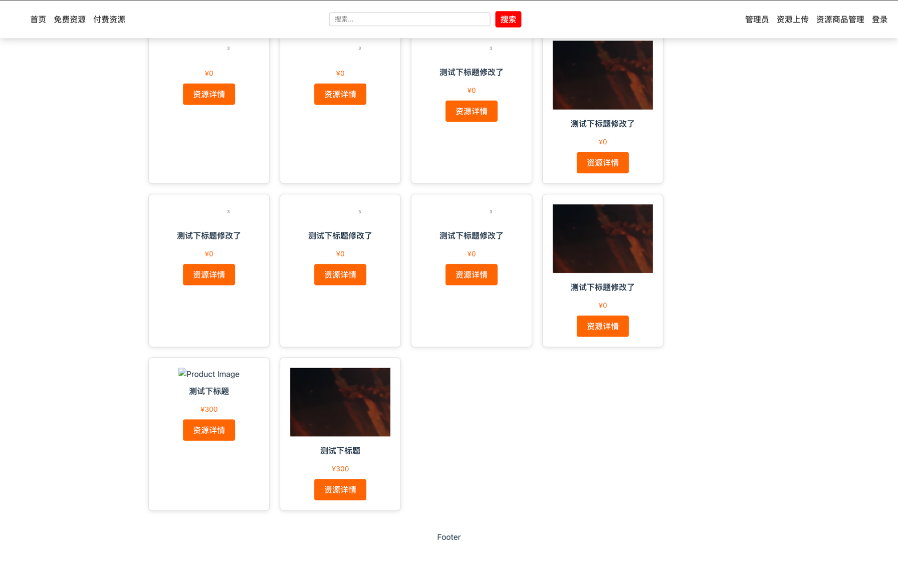
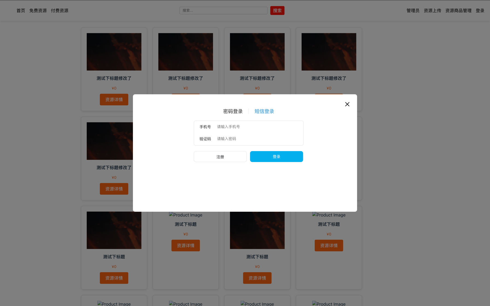
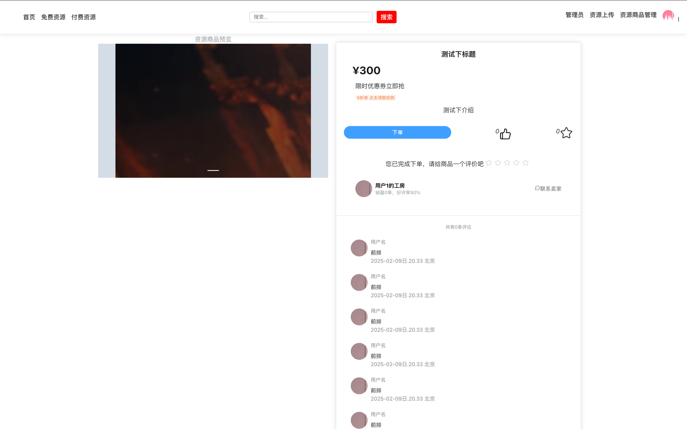
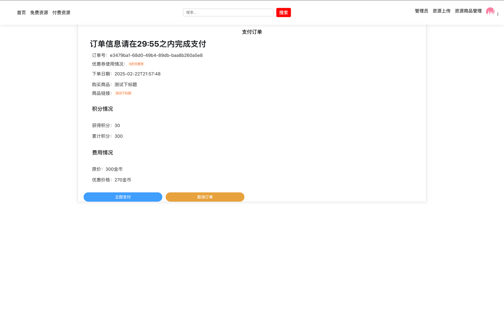
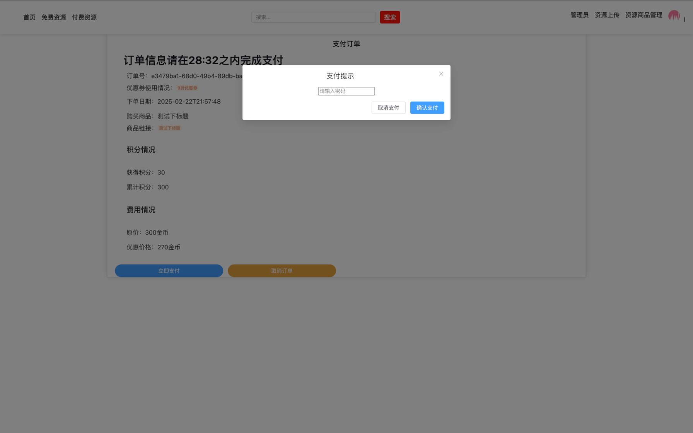

#资源交易商城
### 功能简介
- 商品管理服务：商品上架、商品审核、商品修改、商品下架
- 商品服务；商品详情页、商品列表、商品点赞
- 优惠券服务：卖家上架优惠券、用户优惠券抢购
- 订单服务：商品下单、取消订单
- 支付服务：商品订单支付
- 用户服务：用户注册、用户登录
- 用户积分服务：用户积分查看
- 用户钱包服务：订单扣款
- 卖家收益服务：订单收益
  

### 技术栈
- springboot
- mybatisPlus
- mysql
- redis
- minio

### 功能前端展示
网站首页
这里都属于测试数据 样式有点丑

密码登录

验证码登录

商品详情页（包括下单与点赞）

商品下单详情页（包括优惠券使用情况、积分、需支付金额）

商品订单支付
